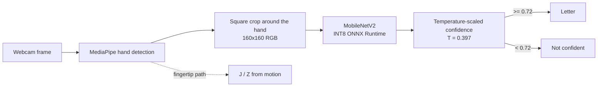

# asl-realtime-inference

> Real-time ASL alphabet recognition on a plain CPU - a 2.69 MB INT8 model that says
> "not confident" instead of guessing.

[](https://github.com/Pranay777777/asl-realtime-inference/actions/workflows/ci.yml)

[](LICENSE)

## The problem

Fingerspelling practice tools need to read a hand from an ordinary webcam, fast, on the
laptop people already own - and a learner is better served by "not sure" than by a confident
wrong letter. The original Keras model took about 120 ms per frame on CPU, and its raw softmax
scores could not be trusted as confidence.

## How it works



A MobileNetV2 trained with transfer learning on the Kaggle *ASL Alphabet* photos is exported to
ONNX and quantised to INT8. Temperature scaling, fitted on held-out images, turns its scores into
calibrated confidence; below the threshold the app abstains. J and Z are signed with motion, so
`predict.py --dynamic` reads them from the fingertip path instead of a single frame.

## Results

<!-- inference:start -->
## Fast inference: ONNX + INT8

Scored on 2600 images (16 of 26 letters from a local copy of the training data; may overlap training images, so accuracy is optimistic), input 160x160; batch size 1 on Intel64 Family 6 Model 140 Stepping 1, GenuineIntel (8 threads).

| Variant | Size (MB) | Accuracy | Δ accuracy | p50 (ms) | p95 (ms) | FPS | Speed-up |
|---|---:|---:|---:|---:|---:|---:|---:|
| Keras FP32 | 24.96 | 99.92% | +0.00 pp | 120.1 | 169.22 | 7.8 | 1.0x |
| ONNX FP32 | 9.04 | 99.92% | +0.00 pp | 2.06 | 2.69 | 471.1 | 60.4x |
| ONNX INT8 | 2.69 | 99.96% | +0.04 pp | 1.33 | 1.56 | 757.3 | 97.0x |

Calibrated abstain threshold 0.72: answers 100% of held-out images at 99.9% accuracy, says *not confident* otherwise. Details, limitations and how to reproduce: [MODEL_CARD.md](MODEL_CARD.md).
<!-- inference:end -->

How it was measured, what the numbers do and do not show, and the limitations:
[MODEL_CARD.md](MODEL_CARD.md).

## Design decisions and tradeoffs

**INT8 over FP32.** 97x faster than Keras per image and 9x smaller, at +0.04 pp accuracy on the
same images. Cost: quantisation can shift rare cases; the benchmark compares both variants on
the same images so a regression would show.

**Abstain instead of always answering.** For a learning tool a confident wrong letter is worse
than "not sure". Cost: some correct letters are withheld; the threshold was fitted on dataset
photos, so it is untested on real webcam frames (see limitations).

**MediaPipe crop over a fixed box.** The hand can be anywhere in the frame. Cost: an extra
model per frame, and MediaPipe misses some small, dark crops - the live demo then says "no
hand found" rather than guessing.

## Quickstart

```bash
git clone https://github.com/Pranay777777/asl-realtime-inference.git && cd asl-realtime-inference
python -m venv venv && venv/Scripts/python.exe -m pip install -r requirements.txt   # venv/bin/python on Linux/macOS
venv/Scripts/python.exe -m pytest -q
```

Download the [Kaggle ASL Alphabet](https://www.kaggle.com/datasets/grassknoted/asl-alphabet) dataset
into `data/asl_alphabet/asl_alphabet_train/<LETTER>/` (it is not committed), then:

```bash
python train.py --data_dir data/asl_alphabet/asl_alphabet_train --out_dir models --img_size 160 160
python eval.py --data_dir data/asl_alphabet/asl_alphabet_train --model_path models/model.keras --labels_path models/labels.json
python predict.py --model_path models/model.keras --labels_path models/labels.json --use_mediapipe --dynamic
python predict.py --model_path models/model.keras --labels_path models/labels.json --test_image path/to/hand.jpg
```

`predict.py` reads `models/calibration.json` for the temperature and abstain threshold. Useful
flags: `--mirror`, `--clahe` (lighting), `--skin_mask` (background), `--no_tta`, `--camera N`.
Webcam keys: `a` append the letter, `space`, `d` delete, `c` clear, `s` save the crop, `q` quit.

Fast inference (export, quantise, benchmark, calibrate, regenerate the model card):

```bash
python -m pip install -r requirements-inference.txt && python -m pip install --no-deps tf2onnx==1.16.1
python -m inference.export_onnx
python -m inference.quantize --data_dir data/asl_alphabet/asl_alphabet_train
python -m inference.benchmark --data_dir data/asl_alphabet/asl_alphabet_train
python -m inference.calibrate --data_dir data/asl_alphabet/asl_alphabet_train
python -m inference.model_card
```

## Limitations

- Accuracy figures are optimistic: the scored images come from a local copy of the training
  data and may overlap what the model saw. Latency, size and INT8-vs-FP32 are unaffected.
- Few signers and plain backgrounds in the training data: expect lower accuracy for other skin
  tones, lighting and cluttered backgrounds - not yet measured.
- Single static letters (plus J/Z from motion), not words or sentences; not an interpreter.
- Tests that need the dataset or trained model skip in CI, where neither is available.
